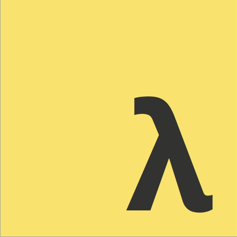

<p align="center">
    
</p>

# FPJS-workshop

⚡️ My workshop to teach **functional programming** principles in JavaScript

## Installation

```sh
$ git clone https://github.com/kutyel/fpjs-workshop.git
...
$ cd fpjs-workshop
$ npm install
...
$ npm test
```

Tip: when `jest` asks for which tests to run, press "o" (that will save you the noise!) 📢

See the breaking tests and follow along! 🚀

### Part 1) [FP Basics](https://fpjs-talk.now.sh/#0): curry, compose & pointfree 🐏

### Part 2) [Lenses](https://functional-lenses.now.sh/#0)! 👓

### Part 3) ADTs: Functor, Applicative & Monad! 🙊

The slides for **part 3** can be found in this same repo, on the [deck.mdx](https://github.com/kutyel/fpjs-workshop/blob/master/deck.mdx) file!
